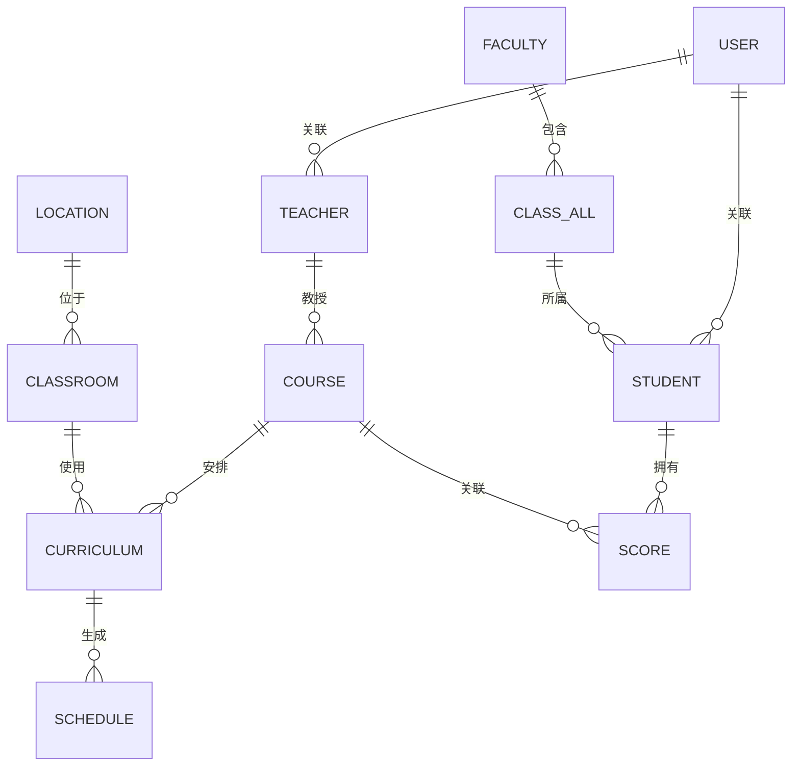
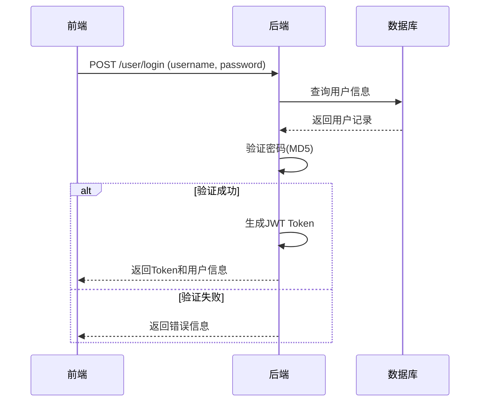
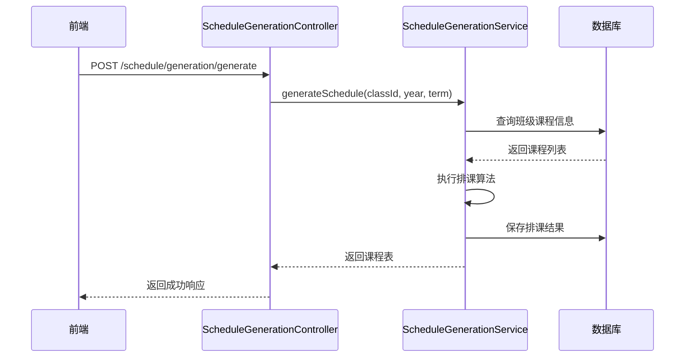
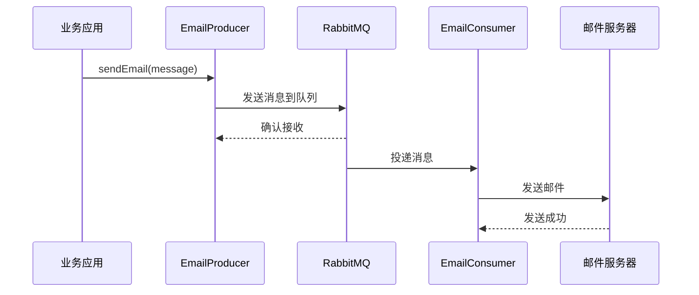

# 智慧日程教务系统

> 🎓 SmartSchedule_TeachingMgmt - 基于 Spring Boot + Vue 的智能排课教学管理系统

## 一、项目简介

智慧日程教务系统是一款面向高校和培训机构的综合性教学管理平台，旨在通过智能化技术提升教学管理效率，实现排课自动化、成绩管理数字化、教学数据分析智能化。

### 核心价值

- **智能排课**：基于约束条件的自动化课程表生成算法
- **数据驱动**：集成AI分析能力，提供教学数据洞察
- **高效协作**：支持教师、学生、管理员多角色协同
- **高可用架构**：采用消息队列实现异步解耦

---

## 二、技术栈

### 后端技术

| 技术 | 版本 | 说明 |
|------|------|------|
| Spring Boot | 3.4.5 | 应用框架 |
| MyBatis Plus | 3.5.5 | ORM框架 |
| MySQL | 8.0+ | 数据库 |
| Redis | 7.0+ | 缓存 |
| RabbitMQ | 3.12+ | 消息队列 |
| JWT | 4.4.0 | 身份认证 |
| Druid | 1.2.18 | 连接池 |

### 前端技术

| 技术 | 版本 | 说明 |
|------|------|------|
| Vue | 3.3.4 | 前端框架 |
| Vite | 4.4.11 | 构建工具 |
| Element Plus | 2.4.1 | UI组件库 |
| Pinia | 2.3.1 | 状态管理 |
| Vue Router | 4.2.5 | 路由 |
| Axios | 1.5.1 | HTTP客户端 |

---

## 三、项目结构

```
SmartSchedule_TeachingMgmt/
├── SmartSchedule_TeachingMgmt/    # 后端应用
│   ├── src/main/java/com/crystalwjh/smartschedule_teachingmgmt/
│   │   ├── config/                # 配置类
│   │   ├── controller/            # REST API控制器
│   │   ├── entities/              # 实体类
│   │   ├── service/               # 业务逻辑层
│   │   ├── mapper/                # MyBatis Plus Mapper
│   │   ├── utils/                 # 工具类
│   │   ├── vo/                    # 视图对象(DTO)
│   │   ├── interceptors/          # 拦截器
│   │   ├── producer/              # 消息生产者
│   │   └── consumer/              # 消息消费者
│   └── src/main/resources/
│       ├── application.yml        # 应用配置
│       └── logback-spring.xml     # 日志配置
└── frontend/                      # 前端应用
    ├── src/
    │   ├── api/                   # API请求封装
    │   ├── views/                 # 页面组件
    │   ├── router/                # 路由配置
    │   ├── stores/                # Pinia状态管理
    │   └── utils/                 # 工具函数
    ├── index.html
    ├── package.json
    └── vite.config.js
```

---

## 四、核心功能模块

### 4.1 用户认证与权限管理

| 功能 | 说明 |
|------|------|
| 用户登录/注册 | 支持管理员、教师、学生三种角色 |
| JWT认证 | 无状态身份认证机制 |
| 权限控制 | 基于角色的访问控制(RBAC) |
| 用户管理 | 用户信息增删改查、禁用/启用 |

### 4.2 教学基础数据管理

| 模块 | 功能 |
|------|------|
| 院系管理 | 院系信息维护 |
| 班级管理 | 班级信息管理 |
| 教师管理 | 教师信息、授课科目管理 |
| 学生管理 | 学生信息、所属班级管理 |
| 课程管理 | 课程基本信息维护 |
| 教室管理 | 教室资源管理 |

### 4.3 智能排课系统

| 功能 | 说明 |
|------|------|
| 课程安排管理 | 手动录入课程安排 |
| 自动排课 | 根据约束条件自动生成课程表 |
| 课程表查看 | 按班级/教师/学生维度查看 |
| 排课冲突检测 | 自动检测时间、教室冲突 |

### 4.4 成绩管理系统

| 功能 | 说明 |
|------|------|
| 成绩录入 | 教师录入学生成绩 |
| 成绩查询 | 学生/教师查询成绩 |
| 成绩统计 | 班级成绩统计分析 |
| 成绩导出 | 支持成绩数据导出 |

### 4.5 AI分析模块

| 功能 | 说明 |
|------|------|
| 教学数据分析 | AI驱动的教学数据洞察 |
| 智能问答 | 基于AI的课程咨询服务 |
| 学习建议 | 个性化学习建议生成 |

### 4.6 邮件通知服务

| 功能 | 说明 |
|------|------|
| 异步邮件发送 | 基于RabbitMQ的异步通知 |
| 成绩通知 | 成绩发布邮件提醒 |
| 课程变动通知 | 课程表变更通知 |

---

## 五、数据库实体关系



### 核心实体说明

| 实体 | 说明 | 关键字段 |
|------|------|----------|
| User | 系统用户 | id, username, type, email |
| Student | 学生信息 | id, name, classId, facultyId |
| Teacher | 教师信息 | id, name, facultyId, phone |
| Course | 课程信息 | id, name, credit, facultyId |
| ClassRoom | 教室信息 | id, name, capacity, locationId |
| Curriculum | 课程安排 | id, courseId, teacherId, classId, timeSlot |
| Schedule | 排课结果 | id, curriculumId, dayOfWeek, period |
| Score | 成绩信息 | id, studentId, courseId, score |
| Faculty | 院系信息 | id, name, description |
| Location | 位置信息 | id, name, building |

---

## 六、部署与运行

### 6.1 环境要求

- JDK 17+
- Maven 3.8+
- MySQL 8.0+
- Redis 7.0+
- RabbitMQ 3.12+
- Node.js 18+

### 6.2 后端启动

1. **配置数据库**
   ```sql
   CREATE DATABASE smartschedule_teachingmgmt CHARACTER SET utf8mb4 COLLATE utf8mb4_unicode_ci;
   ```

2. **修改配置文件**
   - `src/main/resources/application.yml`
   - 配置数据库连接、Redis、RabbitMQ

3. **启动应用**
   ```bash
   cd SmartSchedule_TeachingMgmt
   mvn spring-boot:run
   ```

### 6.3 前端启动

```bash
cd frontend
npm install
npm run dev
```

### 6.4 访问地址

| 服务 | 地址 |
|------|------|
| 后端API | http://localhost:8093/api |
| 前端页面 | http://localhost:5173 |

---

## 七、API接口概览

### 7.1 用户认证

| 接口 | 方法 | 说明 |
|------|------|------|
| `/user/login` | POST | 用户登录 |
| `/user/register` | POST | 用户注册 |
| `/user/logout` | POST | 用户退出 |
| `/user/info` | GET | 获取用户信息 |

### 7.2 教学管理

| 模块 | 基础路径 |
|------|----------|
| 教师管理 | `/teacher` |
| 学生管理 | `/student` |
| 课程管理 | `/course` |
| 班级管理 | `/classAll` |
| 教室管理 | `/classRoom` |
| 院系管理 | `/faculty` |

### 7.3 排课系统

| 接口 | 方法 | 说明 |
|------|------|------|
| `/schedule/generation/generate` | POST | 自动生成课程表 |
| `/curriculum` | CRUD | 课程安排管理 |
| `/schedule` | CRUD | 排课结果管理 |

### 7.4 成绩管理

| 接口 | 方法 | 说明 |
|------|------|------|
| `/score` | POST | 录入成绩 |
| `/score/student/{studentId}` | GET | 查询学生成绩 |
| `/score/class/{classId}` | GET | 查询班级成绩 |

### 7.5 AI分析

| 接口 | 方法 | 说明 |
|------|------|------|
| `/ai/analyze` | POST | 教学数据分析 |
| `/ai/chat` | POST | AI智能问答 |

---

## 八、核心业务流程

### 8.1 登录流程



### 8.2 自动排课流程



### 8.3 邮件通知流程



---

## 九、安全机制

### 9.1 认证机制

- **JWT Token**：无状态认证，Token有效期可配置
- **密码加密**：使用MD5算法加密存储
- **Token刷新**：支持Token过期自动刷新

### 9.2 权限控制

- **登录拦截器**：拦截未登录请求
- **角色验证**：基于用户类型控制访问权限
- **SQL注入防护**：使用MyBatis Plus参数化查询

### 9.3 数据安全

- **输入校验**：使用Bean Validation验证请求参数
- **异常处理**：全局异常处理器统一处理
- **日志审计**：记录关键操作日志

---

## 十、开发说明

### 10.1 代码规范

- **命名规范**：类名使用大驼峰，方法名使用小驼峰
- **注释规范**：关键方法和类添加Javadoc注释
- **异常处理**：统一使用Result封装响应

### 10.2 开发流程

1. Fork项目到个人仓库
2. 创建功能分支
3. 提交代码并发起PR
4. 代码审查通过后合并

### 10.3 测试

```bash
# 运行单元测试
mvn test

# 运行指定测试类
mvn test -Dtest=JwtUtilTest
```

---

## 十一、项目维护

### 11.1 版本记录

| 版本 | 日期 | 更新内容 |
|------|------|----------|
| v0.0.1 | 2024 | 初始版本，基础功能实现 |

### 11.2 联系方式

如有问题或建议，欢迎提交Issue或联系开发团队。

---

## 十二、许可证

MIT License

---

*Built with ❤️ by SmartSchedule Team*